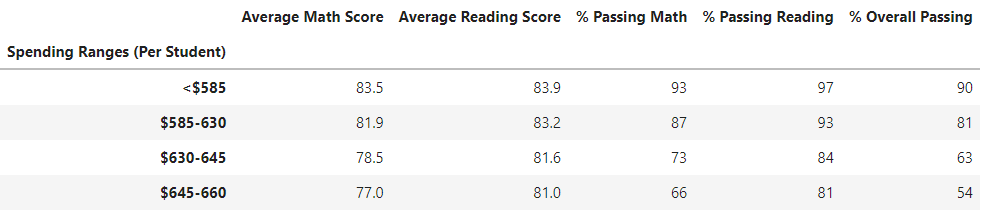
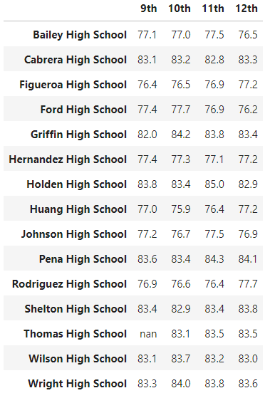
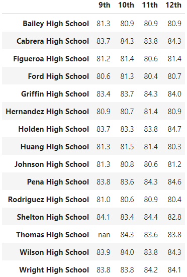

# School_District_Analysis

## Overview of The School District Analysis
The School District Analysis is an in depth look at a school district by various factors. These factors include:
* Grade Level (9th, 10th, 11th, 12th)
* Economic (School Budget)
* Student Population (Size of student body)
* Type of School (District or Charter)
The project digs in deep into the math scores, reading scores, and overall scores of the schools and students alike. Examining the impact of the various factors on the average student's grades and determine school funding.

## Results
The correlations between the various factors could not be more apparent. Schools with higher student populations, also had higher per student school budgets and also had lower overall passing percentages. 
Charter school had the best overall passing percentages, but it is worth noting that they overall had much smaller student populations. 
It is an odd corrolation that schools with the higher per student budget would have some of the lowest overall passing percentages, but that speaks more to the schools' overall populations.
In replacing Thomas High School's Math and Reading scores, Thomas High was more in line with the other charter schools. The impact of the change is felt across all the factors. See charts below:

Grades by Spending Per Student:

Math Grades by Grade Levels:

Reading Grades by Grade Levels:

## Summary
This project clearly shows the benefits of Charter school and smaller student populations. It speaks to the issues of overcrowding in public schools and the need for more schools to accommodate smaller classes. It shows that a higher budget cannot make up for the issue of overcrowded schools. Another factor that may be worth exploring is the average household incomes in the area in which the school is located, as I imagine that plays a factor in the these grades as well.

Pease refer to the Attached JupyterNotebook File:
[PyCitySchools_Challenge.ipynb](./PyCitySchools_Challenge.ipynb)